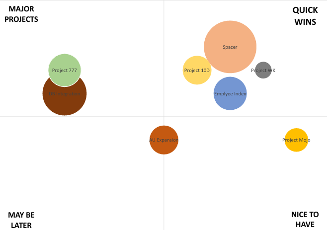

# Project Priority Matrix

## Overview
This repository contains an analysis and visualization of a project priority matrix based on three key criteria:
1. **Feasibility** (X-axis)
2. **Impact** (Y-axis)
3. **Size** (circle size in the visualization)

The objective of the matrix is to help prioritize projects by assessing their feasibility and impact, while also considering their size as a scaling factor.

## Data
The matrix is based on the following dataset:

| Criteria   | Spacer | Project Mojo | AU Expansion | DB Integration | Employee Index | Project 777 | Project 10D | Project WK |
|------------|--------|--------------|--------------|----------------|----------------|-------------|-------------|------------|
| Feasibility | 7      | 9            | 5            | 2              | 7              | 2           | 6           | 8          |
| Impact     | 8      | 4            | 4            | 6              | 6              | 7           | 7           | 7          |
| Size       | 10     | 2            | 3            | 7              | 4              | 4           | 3           | 1          |

## Visualization
The project priority matrix visualizes the data in a scatter plot:
- **X-axis**: Feasibility, representing the practicality or ease of implementing the project.
- **Y-axis**: Impact, showing the potential benefits or influence of the project.
- **Bubble Size**: Size, which indicates the scale or resource intensity of the project.

### Quadrants of the Matrix

1. **Quick Wins**: High feasibility and high impact. These projects are both practical and beneficial, making them the top priority for immediate execution.
2. **Major Projects**: Low feasibility but high impact. These projects require significant effort but can deliver substantial benefits if successfully implemented.
3. **May Be Later**: Low feasibility and low impact. These projects are not urgent and can be deferred or reconsidered.
4. **Nice to Have**: High feasibility but low impact. These projects are easy to implement but provide limited benefits and are thus lower priority.

### Purpose of the Priority Matrix
The matrix enables efficient decision-making by categorizing projects based on their strategic importance and practical implementation potential. It provides clarity on which projects should be pursued immediately and which can be deprioritized.

## Usage
This matrix can be used to:
- Prioritize projects based on their feasibility and impact.
- Identify high-impact projects with high feasibility for immediate focus.
- Plan resources for large projects with medium or low feasibility.
- Enhance strategic decision-making by visualizing project data.

